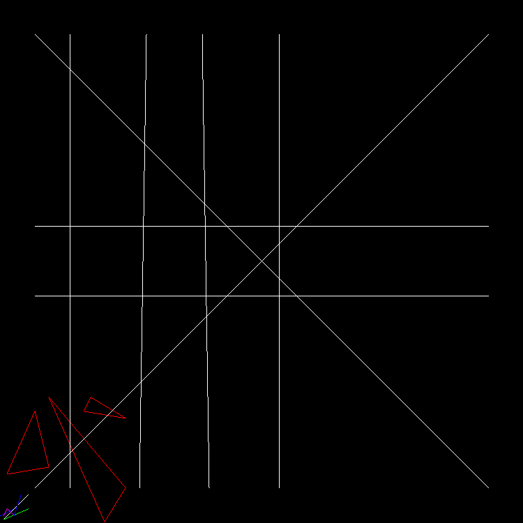

# Tiny Renderer Tutorial

## Why I'm doing this

I found a cool project on GitHub called [Tiny Renderer](https://github.com/ssloy/tinyrenderer). It shows you how OpenGL works by making you remake a tiny version of it. IDK how to write C++ code, but I like the idea of making a renderer from scratch, so I'm either going to do it or get stuck on how to run a C++ program.

## Progress

I'm going to periodically update this whenever I feel like it. I'm not going to worry about keeping this up to date, since the purpose of this project is to learn more about C++ and OpenGL, not write a blog.

### 11/02 - 11/04

Finished lesson 1

While I did copy most of the code from the guy's "snapshots," I did write the code for making the lines all by myself

### 11/05 - 11/06

Tried to do lesson 2. It did not go well
First, I discovered that my line code had a lot of problems, so I had to scratch that and import the guy's line code
Then, I had a lot of problems regarding the triangle
Long story short, I'm taking a break from this project

### 11/07

I'm not taking a break. I WILL NOT LET THE TRIANGLES BEAT ME!
Current plan:
- Figure out how other rendering libraries like [this one](https://www.rose-hulman.edu/class/csse/resources/Python/ZelleGraphics.html)
- Try to figure a different way of making triangles (the one I tried before was garbage)

EDIT: Turns out, that example graphics library used another graphics library called [tkinter](https://realpython.com/python-gui-tkinter/)
      If I can find the source code of that, that would work better

### 11/30

I had to take a break
Long story short, a friend recommended I learn linear algebra, since vectors are a big part of how renderers work
I'm also thinging of changing my primary language to Python, as I already know that
I downloaded some libraries to test out, and the next update will detail the results of those experiments

Here are some resources I found
- [pyTGA](https://github.com/MircoT/pyTGA)
- [Some stuff on how rasterization works](https://www.scratchapixel.com/lessons/3d-basic-rendering/rasterization-practical-implementation/projection-stage.html)
- [Khan Academy is amazing](https://www.khanacademy.org/math/linear-algebra/vectors-and-spaces/vectors/v/linear-algebra-parametric-representations-of-lines)

EDIT: I'm going to have to figure out how to install pyTGA safely if I am going to use it. I also need to evaluate my options carefully. I do NOT want to discover halfway though the tutorial that my core graphics library is flawed

### 12/04

Started testing how various parts of this project works with python and matplotlib, cus it is easier

### 12/12

Taking a different direction from what I planned
Long story short, I am completely rewriting the code for myline, so that I understand how it works
I should have tried to make a line function on my own from the start

### 01/05

I finally got the myline code working
Currently, I am only on [step 1](https://github.com/ssloy/tinyrenderer/wiki/Lesson-1:-Bresenham%E2%80%99s-Line-Drawing-Algorithm) of the tutorial
If I looked closely, I could have seen that the algorithm that was used by the teacher had a name
Oh well, at least I can say that I made my own line algorithm
My line drawing algorithm uses y=mx+b
It finds all the values in that equation, then only draws the parts of the equation that is needed
I am proud of my algorithm
HOWEVER, I only have the basic algorithm of step 1.1, I still need to make the rest of the algorithm so it can handle steep lines and stuff like that

### 01/05 - continued

Long story short, step 1.2 and 1.3 were completed
Step 1.2:
    Turns out, I already completed this step earlier
    This handles every "step" (every time a pixel is created), and my algorithm already handles this
Step 1.3:
    This step covers handling steep lines and right-to-left lines
The code needs to be cleaned up a lot, but otherwise I think it is good

### 01/06

The code was cleaned up a little 
- Comments were removed
- A bug was patched out regarding steep left-to-right lines
- The original line code was removed (myline is now just called line)
Also, a wireframe version of the face was made with the new line
Lesson 1 is done

### 01/25

Had some IRL stuff that got in the way of this project
However, I'm on the right track
I figured out how the basics of how I am going to render a triangle
I did some tests in Python

### 02/05

I figured out how to work on this project portably
Currently, I use CoCalc of I want to work to work on a programming project portablly
However, CoCalc doesn't allow you to install programs, and it didn't have any preinstalled programs that could view TGA images
I found a workaround in the form of the AppImage version of ImageMagick
ImageMagick allows you to convert an image to a different format, and the AppImage version can be ran on CoCalc (after using --appimage-extract)
TLDR, I can work on this project more consistently

On a side note, I did some testing in python
Initially, I just wanted to see if a Jupyter Notebook supported TGA images
Then it spiralled into me trying to recreate the entire renderer so far in Python because I was bored
It didn't end up working, but it made me think about what I have doon so far
For example, why does the line need to be drawn left-to-right?
My line algorith is different than the one in the tutorial, so I should test that, right?
Additionally, I am thinking about if turning the lines into classes
I probably won't turn the lines or tiangles or other shapes into classes, but it is still a good idea to think about my code along these lines

### 02/08

I am working on the triangle code, and I want to document what I have done so far
First, the vectors that represent the 3 points of a triangle are sorted from the highest y to lowest y
Then, the triangle code finds the slope and y intercept of the 3 sides before drawing anything
This is where I am at currently
Additionally, I attached a picture to show what I currently have for future reference on what changes

